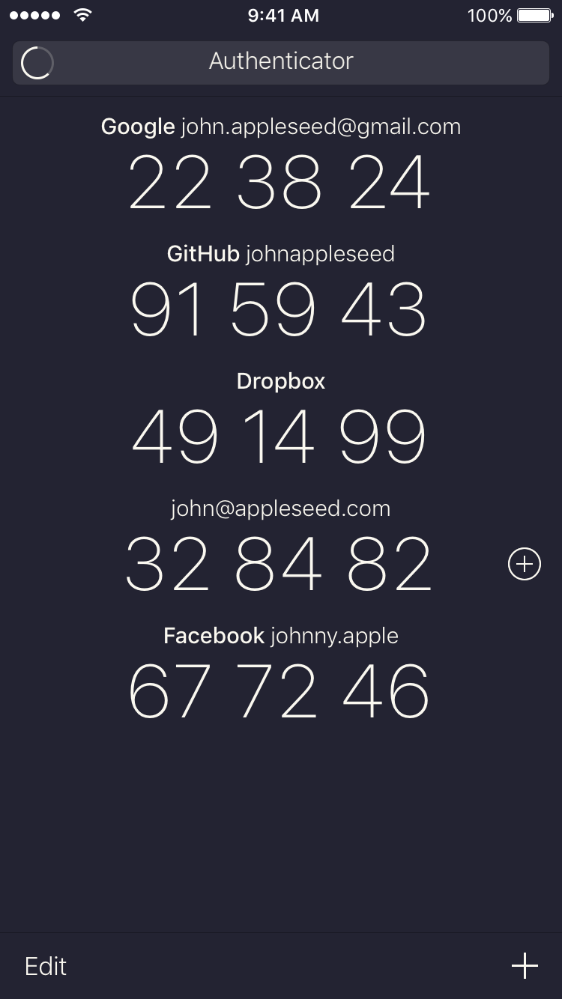
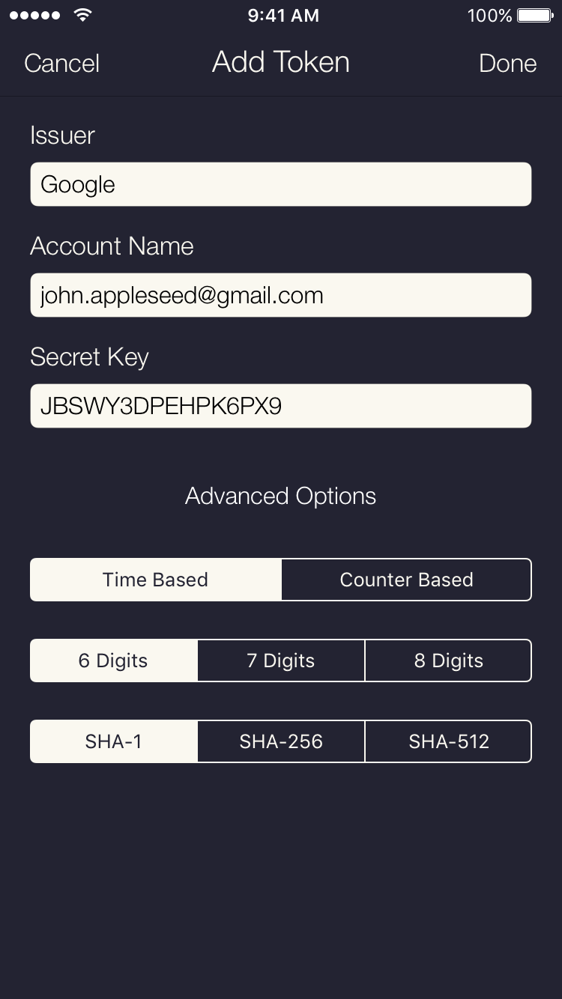

# Authenticator
### Two-Factor Authentication Client for iOS.

[](https://travis-ci.org/mattrubin/Authenticator)
[](https://codecov.io/gh/mattrubin/Authenticator)
[](https://github.com/mattrubin/authenticator/releases)
[](LICENSE.txt)


Authenticator is a simple, free, and open source [two-factor authentication](https://en.wikipedia.org/wiki/Two-factor_authentication) app. It helps keep your online accounts secure by generating unique one-time passwords, which you use in combination with your other passwords to log into supporting websites. The simple combination of the password in your head and the rotating passwords generated by the app make it much harder for anyone but you to access your accounts.

- Easy: Simple setup via QR code, ["otpauth://" URL](https://code.google.com/p/google-authenticator/wiki/KeyUriFormat), or manual entry
- Secure: All data is stored in encrypted form on the iOS keychain
- Compatible: Full support for [time-based](https://tools.ietf.org/html/rfc6238) and [counter-based](https://tools.ietf.org/html/rfc4226) one-time passwords as standardized in RFC 4226 and 6238
- Off the Grid: The app never connects to the internet, and your secret keys never leave your device.

 &nbsp;
 &nbsp;



## Getting Started

1. Check out the latest version of the project:
  ```
  git clone https://github.com/mattrubin/Authenticator.git
  ```

2. In the Authenticator directory, check out the project's dependencies:
  ```
  cd Authenticator
  git submodule update --init --recursive
  ```

3. Open the `Authenticator.xcworkspace` file.
> If you open the `.xcodeproj` instead, the project will not be able to find its dependencies.

4. Build and run the "Authenticator" scheme.


## Managing Dependencies

Authenticator uses [Carthage] to manage its dependencies, but it does not currently use Carthage to build those dependencies. The dependency projects are checked out as submodules, are included in `Authenticator.xcworkspace`, and are built by Xcode as target dependencies of the Authenticator app.

To check out the dependencies, simply follow the "Getting Started" instructions above.

To update the dependencies, modify the [Cartfile] and run:
```
carthage update --no-build --use-submodules
```

[Carthage]: https://github.com/Carthage/Carthage
[Cartfile]: Cartfile


## License

This project is made available under the terms of the [MIT License](http://opensource.org/licenses/MIT).

The modern Authenticator grew out of the abandoned source for [Google Authenticator](https://code.google.com/p/google-authenticator/) for iOS. The original Google code on which this project was based is licensed under the [Apache License, Version 2.0](https://www.apache.org/licenses/LICENSE-2.0).
